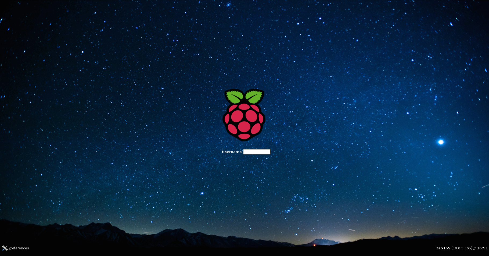
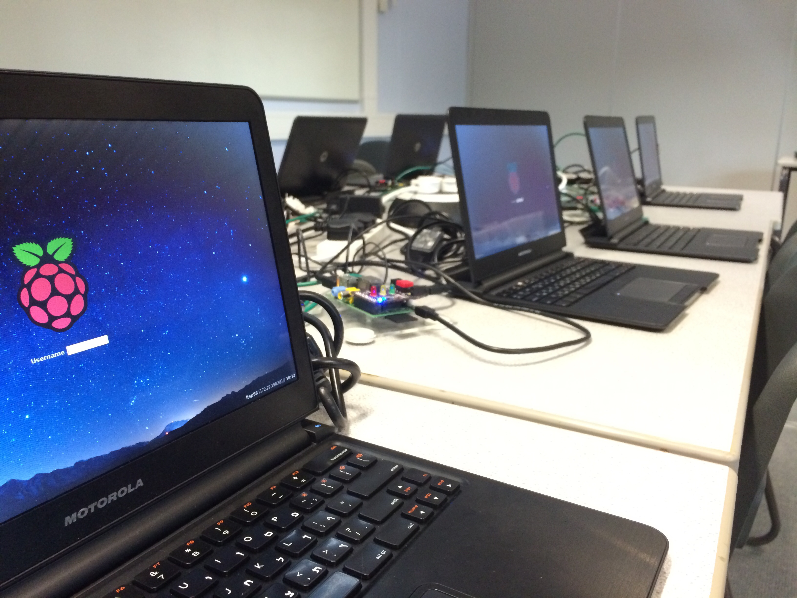

PiNet (Previously RaspberryPi-LTSP)
================

      
#PiNet Website - http://pinet.org.uk    
------   
###"*PiNet is a utility for setting up the infrastructure required for a permanent classroom set of Raspberry Pis."*    
PiNet is has been written to help support educators in using the Raspberry Pi computer in their classrooms   
Its main features include
- **Network based user accounts** - A student can log onto any Raspberry Pi in the classroom and have access to their files. Their files are stored centrally on the server.
- **Centralised master operating system** - All the Raspberry Pis boot a single master operating system from the server every boot. So no more need to flash Raspbian onto 30+ SD cards. Just copy 30mb onto the SD cards.
- **Automated work submission and collection system** - A teacher can easily collect work from students digitally completely automatically for marking without the need for printing.
- **Shared folders** - Teachers can set up shared folders which are available to every Raspberry Pi in the classroom. These can be set up as read-only or read/write for students.   
- **Easy installation of software** - Software can be easily installed with from a menu of suggested packages including Libreoffice, ScratchGPIO5 and Python hardware libraries (like the Pibrella library).  
- **Epoptes classroom management software integration** - Epoptes classroom management software is integrated automatically allowing educators to blank students screens, reboot or shutdown all Raspberry Pis.
- **Easy to configure backups** - Educators can easily setup backups for the entire classes work to be saved on an external hard drive on a daily or weekly basis.   
- **It is completely free and open-source** - PiNet is completely free and open-source for everybody!   
- **Extensive documentation** - Alongside PiNet, there is also an extensive website of documentation with currently over 30 sections covering all features with over 100 images/screengrabs. This can be found at [http://pinet.org.uk](http://pinet.org.uk).   
- **Fully supports the OCR GCSE CS A452 task** \* - PiNet full supports the OCR GCSE Computer Science A452 Linux task which requires students to be able to work with files, create users and groups and also install software. All of this is possible with PiNet.   
     
          
PiNet is designed for teachers to setup their own mini Raspberry Pi networks. 
The installation process is extremely simple and well supported by the documentation. 
It is so simple, we even have an 11 year old who manages his entire schools PiNet network for the teachers of the school in his spare time.      
   
Simplicity is the key to PiNet.   

\* The OCR GCSE CS A452 task is not supported on the original Raspberry Pi model B revision 1 with 256mb of RAM as it is unable to install additional packages due to a lack of RAM.

##Feedback
A number of schools across the world have been trialing the Alpha versions of PiNet for a number of months now.   
The overall feedback has been excellent with overwhelmingly positive feedback from educators.   

----
   
*"I see no other way an educator can use Raspberry Pi effectively in a classroom on a day to day basis without PiNet"* - **Ben Smith, ArnoldKEQMS school.**   

*"After the initial setup of PiNet, the server makes running a Pi club so much easier. The user accounts make it ideal for having multiple sessions with different students without the hassle of knowing who's work is on what Raspberry Pi"* - **Ryan Walmsley, North Hertfordshire College
Raspberry Pi Club.**

##License

This program is free software; you can redistribute it and/or modify
it under the terms of the GNU General Public License as published by
the Free Software Foundation; either version 2 of the License, or
(at your option) any later version.   

This program is distributed in the hope that it will be useful,
but WITHOUT ANY WARRANTY; without even the implied warranty of
MERCHANTABILITY or FITNESS FOR A PARTICULAR PURPOSE.  See the
GNU General Public License for more details.    
   
For details on the License of this project, see the LICENSE file.
